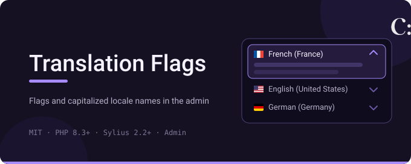
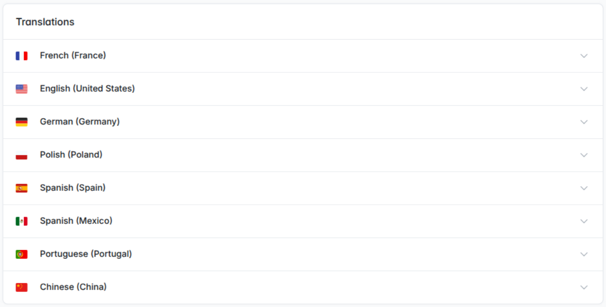

# Sylius Translation Flags Plugin

<!-- Badge targets assume the repositories' future home under github.com/CylleneDigital —
     adjust the repository names here and in .github/workflows/ if they differ. -->
[](LICENSE)
[](https://packagist.org/packages/cyllene-digital/sylius-translation-flags-plugin)
[](https://github.com/CylleneDigital/SyliusTranslationFlagsPlugin/actions/workflows/build.yaml)
[](https://github.com/CylleneDigital/SyliusTranslationFlagsPlugin/actions/workflows/security.yaml)

A **Sylius admin plugin** that fixes the rendering of the **translations accordions** in the
back-office: every locale header gets a **flag icon** before a **capitalized** locale name.



## Compatibility

| Component | Versions |
|---|---|
| PHP | `>=8.3` |
| Sylius | `~2.2.0 \|\| ~2.3.0` |
| Symfony | `^7.4 \|\| ^8.0` |

**Why 2.2 is the floor**: the `flagpack` icon set only exists in Sylius 2.2+. On 2.1 the
plugin loads but renders no flag; on 2.0 the accordion template is different and
`ux_icon('flagpack:…')` throws — do not install the plugin there.

## Installation

```bash
composer require cyllene-digital/sylius-translation-flags-plugin
```

The Flex recipe registers the bundle. Without Flex:

```php
// config/bundles.php
CylleneDigital\SyliusTranslationFlagsPlugin\CylleneDigitalSyliusTranslationFlagsPlugin::class => ['all' => true],
```

That's it — the override is active as soon as the bundle is registered.

## How it works

The extension's `prepend()` registers the plugin's `templates/admin` directory under the
`@SyliusAdmin` Twig namespace **before** the core AdminBundle's own `templates/` directory
(`src/DependencyInjection/CylleneDigitalSyliusTranslationFlagsExtension.php`), so
`templates/admin/shared/helper/translations.html.twig` — a copy of the core template with
the improved `accordion_header` macro — shadows it for **every** translations form:
products, variants, taxons, promotions, payment and shipping methods, options, attributes…

## Status

**Exercised on a real Sylius 2.3 back office**: the functional tests render the taxon edit
page through the HTTP kernel, log an admin in, and assert on the rendered HTML — every
accordion header carries exactly one flag icon, before the capitalized locale name. The same
page was walked by hand in the development environment (PHP 8.4, Symfony 7.4, MariaDB).

**The continuous integration matrix** runs the functional tests, PHPStan at `max` level,
the coding standard and template linting on PHP 8.3 and 8.4, against Sylius 2.2 and 2.3
with MariaDB. (`sylius/test-application` is a development-only package that ships alpha
versions in every minor — v2.3.0-ALPHA.3 / v2.2.0-ALPHA.1 here — that is normal.)

Sylius 2.1 and 2.0 are not supported — see the compatibility note above.

The scope stops at the back-office translations accordion: the shop is untouched, and the
plugin carries no configuration, no route, no table and no command.

## Contributing

[`CONTRIBUTING.md`](CONTRIBUTING.md) - setting up the test environment, standards, what has to pass.

## Provenance and licence

Released under the **MIT** licence — see [`LICENSE`](LICENSE). The flag icons come from
[flagpack](https://flagicon.com) (MIT), shipped with Sylius.

---

Package: [`cyllene-digital/sylius-translation-flags-plugin`](https://packagist.org/packages/cyllene-digital/sylius-translation-flags-plugin)

Maintained by [Cyllene](https://www.groupe-cyllene.com), on GitHub as
[@CylleneDigital](https://github.com/CylleneDigital)
