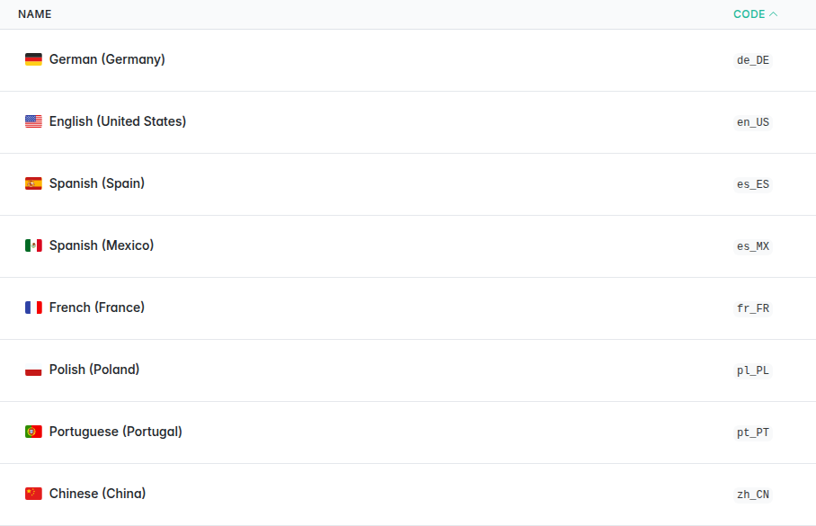

# Sylius Translation Flags Plugin

[](LICENSE)
[](https://packagist.org/packages/cyllene-digital/sylius-translation-flags-plugin)
[](https://github.com/CylleneDigital/SyliusTranslationFlagsPlugin/actions/workflows/build.yaml)
[](https://github.com/CylleneDigital/SyliusTranslationFlagsPlugin/actions/workflows/security.yaml)

A **Sylius admin plugin** that adds **flag icons** to the **translations accordions** and to
the **locales list** in the back-office: every locale label gets a **flag icon** before a
**capitalized** locale name.
Flags used to be displayed in older versions of Sylius but were removed from the core -
see the [ADR](https://github.com/Sylius/Sylius/blob/2.3/adr/2024_11_28_languages_flags.md) for the reasons.




## Compatibility

| Component | Versions |
|---|---|
| PHP | `^8.3` |
| Sylius | `~2.2.0 \|\| ~2.3.0` |
| Symfony | `^7.4 \|\| ^8.0` |

**Why 2.2 is the floor**: the `flagpack` icon set only exists in Sylius 2.2+ - on 2.1 no flag
would render, and on 2.0 the accordion template is different and `ux_icon('flagpack:…')` throws.

**Symfony 8 needs Sylius 2.3** (hence PHP 8.4+): Sylius 2.2 stays on Symfony 7.4.

## Installation

```bash
composer require cyllene-digital/sylius-translation-flags-plugin
```

The Flex recipe registers the bundle. Without Flex:

```php
// config/bundles.php
CylleneDigital\SyliusTranslationFlagsPlugin\CylleneDigitalSyliusTranslationFlagsPlugin::class => ['all' => true],
```

That's it - the overrides are active as soon as the bundle is registered.

## How it works

A compiler pass registers the plugin's `templates/admin` directory under the `@SyliusAdmin`
Twig namespace **right before** the core AdminBundle's own `templates/` directory
(`src/DependencyInjection/Compiler/RegisterAdminTemplatesPathPass.php`), so the plugin's
copies shadow two core templates:

- `shared/helper/translations.html.twig` - the translations accordion of **every**
  translations form: products, variants, taxons, promotions, payment and shipping methods,
  options, attributes…
- `locale/grid/field/name.html.twig` - the name column of the locales list.

Both render the same label, `templates/shared/locale_label.html.twig`
(`@CylleneDigitalSyliusTranslationFlagsPlugin/shared/locale_label.html.twig`): the flag, then
the capitalized locale name.

### Overriding the templates in your project

Your project's overrides still come first: the usual Symfony bundle override wins over the
plugin.

- To change the label everywhere (flag size, no capitalization…), copy
  `templates/shared/locale_label.html.twig` to
  `templates/bundles/CylleneDigitalSyliusTranslationFlagsPlugin/shared/locale_label.html.twig`.
- To change one screen, copy the plugin's template to the same path under
  `templates/bundles/SyliusAdminBundle/`, e.g.
  `templates/bundles/SyliusAdminBundle/shared/helper/translations.html.twig`.

Clear the cache if the `templates/bundles/…` directory did not exist before.

## In production

Sylius ships 16 flagpack flags with its admin: `au`, `br`, `ca`, `cn`, `de`, `es`, `fr`, `gb`,
`in`, `it`, `jp`, `mx`, `nz`, `pl`, `pt` and `us`. The flag of any other country (`nl`, `be`,
`ch`…) is downloaded by Symfony UX Icons from the Iconify API (`https://api.iconify.design`) the
first time it is rendered, then kept in the Symfony system cache until the next cache clear.

Because Sylius sets `ux_icons.ignore_not_found: true`, a server that cannot reach that API
renders those labels **without a flag and without an error**. If your servers have no outbound
HTTPS access, allow `api.iconify.design`, or check that every locale you use has its flag among
the 16 above.

`bin/console ux:icons:import flagpack:<code>` does not work around it: it writes into
`assets/icons/`, while Sylius maps the `flagpack` prefix to its own directory - the only one
looked up for that prefix.

## Status

**Exercised on a real Sylius 2.3 back office**: the functional tests render the taxon edit
page and the locales list through the HTTP kernel, log an admin in, and assert on the rendered
HTML - every accordion header and every locale name carries exactly one flag icon, before the
capitalized locale name. Both screens were also walked by hand in the development environment
(PHP 8.4, Sylius 2.3, Symfony 7.4, MariaDB).

**The continuous integration matrix** runs the unit and functional tests, PHPStan at `max`
level, the coding standard, container and template linting and a strict `composer validate` on
PHP 8.3, 8.4 and 8.5, against Sylius 2.2 and 2.3 with MariaDB. (`sylius/test-application` is a development-only package that ships alpha
versions in every minor - v2.3.0-ALPHA.3 / v2.2.0-ALPHA.1 here - that is normal.)

Sylius 2.1 and 2.0 are not supported - see the compatibility note above.

The scope stops at the back-office translations accordion and locales list: the shop is
untouched, and the plugin carries no configuration, no route, no table and no command.

## Contributing

[`CONTRIBUTING.md`](CONTRIBUTING.md) - setting up the test environment, standards, what has to pass.

A flaw is reported privately: [`SECURITY.md`](SECURITY.md). Do not open it as a public issue.

## Provenance and licence

Released under the **MIT** licence - see [`LICENSE`](LICENSE). The flag icons come from
[flagpack](https://flagpack.xyz/) (MIT): shipped with Sylius for 16 of them, fetched from Iconify
for the others (see "In production").

---

Package: [`cyllene-digital/sylius-translation-flags-plugin`](https://packagist.org/packages/cyllene-digital/sylius-translation-flags-plugin)

Maintained by [Cyllene](https://www.groupe-cyllene.com), on GitHub as
[@CylleneDigital](https://github.com/CylleneDigital)
